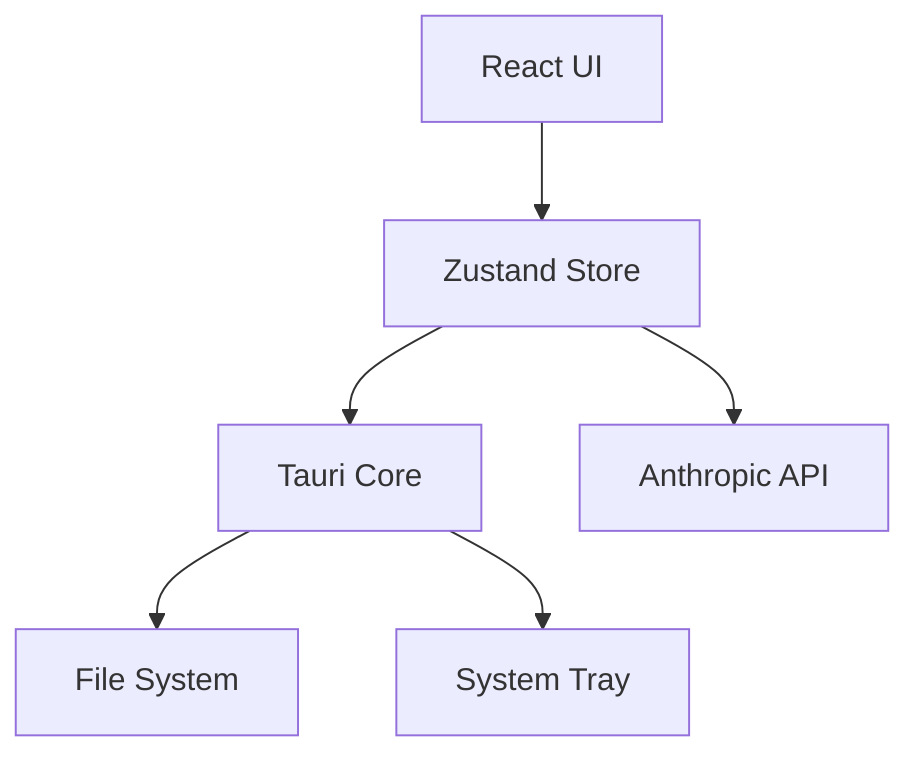

# Claude Config Manager

A premium desktop application built with Tauri, React, and Anthropic's Claude API to manage, automate, and optimize your Claude Code configurations.


## Features

### 🚀 Project Discovery
- **Automatic Scanning:** Discovery projects in your repositories with one click.
- **Deep Integration:** Identifies `CLAUDE.md`, `settings.json`, and `.claudeignore` automatically.

### 🎨 Visual Editing
- **Pattern Builder:** Manage ignore rules and permissions visually without touching raw JSON or glob strings.
- **Smart Suggestions:** One-click addition for common patterns like `node_modules`, `dist/`, or standard permissions.
- **Markdown Preview:** High-fidelity markdown preview for your `CLAUDE.md` files.

### 🧠 AI Assistant
- **Real-time Health Checks:** Automatically identifies missing setup instructions or suboptimal model choices.
- **One-Click Generation:** Generate "Build", "Test", and "Project Rules" sections using Claude 3.5 Sonnet.
- **Contextual Q&A:** Chat with Claude directly about your configuration files.

### 💎 Premium UX
- **Theme Support:** Switch between Light, Dark, and System modes seamlessly.
- **Desktop Ready:** System tray integration and native file handling.
- **Custom Syntax Highlighting:** Specialized Monaco language support for Claude-specific file patterns.

## Tech Stack

- **Frontend:** React 19, Tailwind CSS, shadcn/ui
- **Backend:** Tauri 2.0 (Rust)
- **Editor:** Monaco Editor
- **AI:** Anthropic SDK (Claude 3.5 Sonnet)

## Getting Started

### Prerequisites

- Node.js (v18+)
- Rust (latest stable)
- Anthropic API Key

### Installation

1. Clone the repository:
   ```bash
   git clone https://github.com/your-repo/claude-config-manager.git
   ```
2. Install dependencies:
   ```bash
   npm install
   ```
3. Run the development server:
   ```bash
   npm run tauri dev
   ```

### Configuration

Open the **AI Assistant** panel and click **Configure API Key** to enter your Anthropic credentials. This enables all intelligent features.

## Architecture



## License

MIT - Developed with ❤️ by Antigravity
